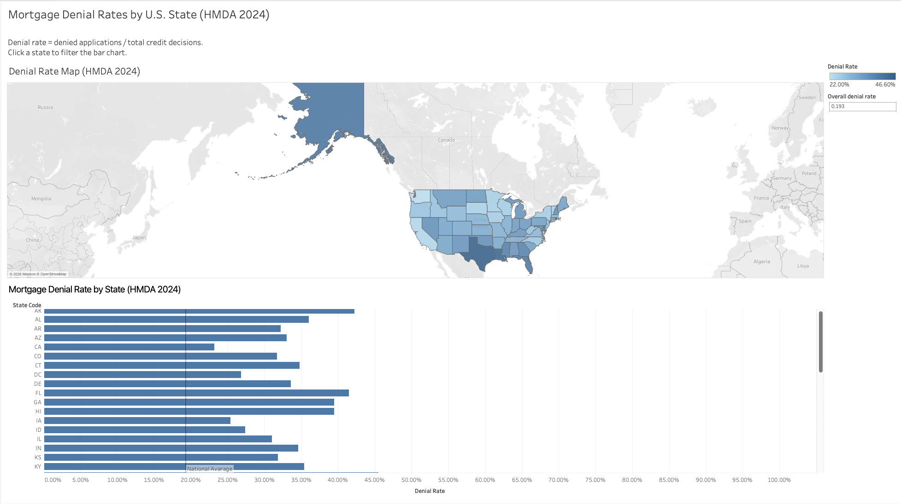

# Mortgage Risk Analysis (HMDA)

This project analyzes U.S. mortgage application outcomes using HMDA Modified Loan/Application Register (LAR) data.
The objective is to quantify mortgage denial rates and examine how they vary geographically across U.S. states.

## Data
- Source: HMDA 2024 Modified Loan/Application Register (LAR)
- Unit of analysis: individual mortgage applications
- Raw data is not included due to size; all analysis steps are fully reproducible using the provided SQL scripts

## Project Structure
- `sql/` — schema creation, data cleaning, and analysis queries
- `notes/` — worklog, modeling decisions, and open questions
- `data/raw/` — placeholder for raw data (not committed)

## Pipeline Overview
1. Create raw schema from CSV header (`01_create_hmda_raw.sql`)
2. Import pipe-delimited HMDA data via SQLite CLI (`02_import_hmda_raw.sql`)
3. Build analysis-ready table (`hmda_clean`)
4. Compute decision-only mortgage denial rates by state

## Key Metric: Mortgage Denial Rate

Mortgage denial rate is defined as:

Number of denied applications /
(Number of approved + denied applications)

The analysis uses HMDA `action_taken` codes to identify credit decisions:
- `1` = Approved / originated
- `2` = Approved but not accepted
- `3` = Denied

Applications that were withdrawn, incomplete, or purchased (codes 4–6) are excluded.
Each application contributes equally to the analysis.

## Mortgage Denial Rates by State (HMDA 2024)

This analysis examines mortgage denial rates across U.S. states using 2024 HMDA data.
Only applications where a lender made a credit decision (approved or denied) are included.
Records with missing state codes are excluded from state-level analysis.

The analysis includes:
- A bar chart ranking states by mortgage denial rate
- A U.S. choropleth map illustrating geographic variation

All data transformations were performed in SQL, and results were visualized using Tableau.

## Interactive Dashboard

Explore the interactive mortgage denial rate dashboard:

👉 https://public.tableau.com/app/profile/meltem.uyanik/viz/MortgageDenialRatesbyStateHMDA2024/MortgageDenialRatesHMDA2024?publish=yes

The dashboard allows users to:
- View mortgage denial rates by U.S. state
- Compare denial rates across states
- Interactively filter results using the map and bar chart

Denial rates vary substantially across states, indicating meaningful geographic variation in mortgage lending outcomes.
